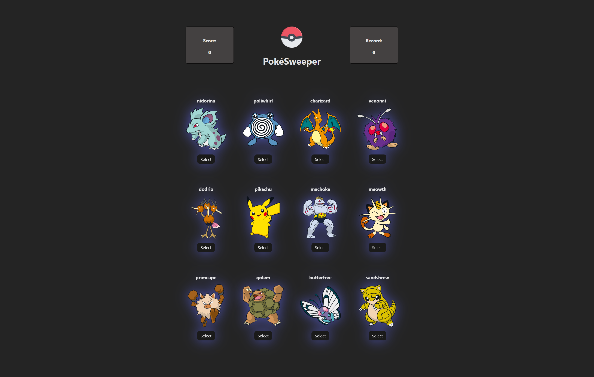

# PokéSweeper
### *A Memory Game*
https://poke-sweeper.netlify.app/

## Version 2.0 - Test Your Pokédexic Memory!

> Hooks: useState(), useEffect()

> API: pokeapi.co

## Docs:
> https://pokeapi.co/docs/v2

### *GET Request:*
> [https://pokeapi.co/api/v2/pokemon/{id or name}/](https://pokeapi.co/api/v2/pokemon/1/)

### *Pokemon (endpoint)*
> Pokémon are the creatures that inhabit the world of the Pokémon games. They can be caught using Pokéballs and trained by battling with other Pokémon. Each Pokémon belongs to a specific species but may take on a variant which makes it differ from other Pokémon of the same species, such as base stats, available abilities and typings. See [Bulbapedia](http://bulbapedia.bulbagarden.net/wiki/Pok%C3%A9mon_(species)) for greater detail.

---
*[Netlify Permalink](https://poke-sweeper.netlify.app/)* | *last updated: March 17, 2025*
